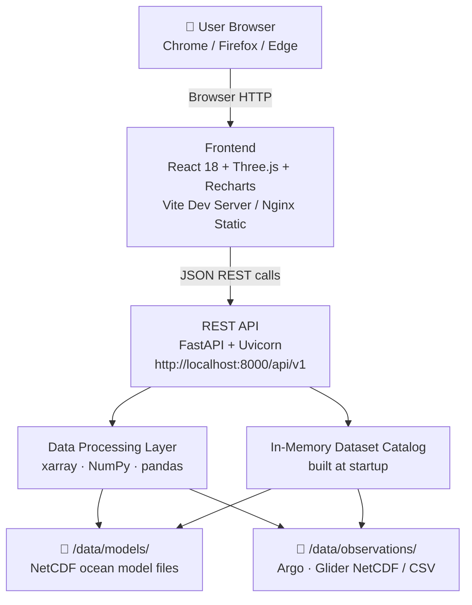

# 3D Ocean Data Visualization System

**INCOIS — Indian National Centre for Ocean Information Services**

> A browser-native, interactive **3D WebGL** platform for visualizing ocean model outputs and in-situ observational data in a unified interactive 3D scientific environment. The primary visualization is a genuine Three.js 3D ocean scene — not a 2D map.

---

## Project Overview

The 3D Ocean Data Visualization System is a web application built for INCOIS that renders ocean model fields and observational instrument data in a single, **interactive browser-based 3D WebGL scene**. It eliminates the need for desktop scientific visualization software by delivering depth-resolved, time-animated, interactive 3D ocean variable visualizations directly in a modern web browser.

The primary visualization mode is **interactive 3D depth-slice visualization**: colored horizontal mesh layers rendered inside a Three.js 3D scene, positioned at the correct ocean depth, navigable by depth level and time step, with full camera rotation/zoom/pan, vertical exaggeration, and current vector arrows overlaid in 3D space.

The system is designed to serve operational oceanographers, forecasters, and researchers, and is architected to scale toward public scientific outreach as the platform matures.

---

## Problem

India's Exclusive Economic Zone (EEZ) spans approximately 2.37 million km². INCOIS continuously generates large volumes of ocean model output (temperature, salinity, current vectors, chlorophyll, and other variables) and receives observational data from Argo profiling floats and underwater gliders.

Currently, there is **no integrated web-based platform** that allows users to:
- Visualize 3D ocean model fields in a browser without specialized desktop software
- See Argo and Glider observation positions overlaid on model fields
- Inspect depth-resolved observational profiles alongside model output
- Navigate through depth levels and time steps interactively
- Customize colorbar scaling for scientific analysis

This forces oceanographers to switch between multiple tools, slowing operational analysis and making scientific correlation more difficult.

---

## Solution

A browser-native, full-stack web application that:

1. **Backend (Python + FastAPI):** Parses NetCDF model datasets and NetCDF/CSV observation datasets from the server filesystem, normalizes them into a consistent internal representation, and serves them through a clean REST API
2. **Frontend (React + Three.js):** Renders model variable depth slices as colored 3D meshes in a WebGL scene; overlays instrument markers; displays interactive profile charts
3. **Modular data pipeline:** New instruments (CTD, BGC, Moorings, etc.) and new model variables can be added by creating new parser modules without changing the core system

---

## Key Features (Version 1)

> **The primary ocean model visualization is a genuine interactive 3D WebGL scene (Three.js).** A depth slice is a horizontal surface rendered *inside* this 3D scene at the correct depth — not a standalone 2D map. The instrument profile chart is an explicitly separate 2D panel.

| Feature                                 | Priority | Description                                                                                                                                    |
|-----------------------------------------|----------|------------------------------------------------------------------------------------------------------------------------------------------------|
| **Interactive 3D WebGL Ocean Scene**    | **P0**   | Three.js scene with rotate/zoom/pan (OrbitControls). Depth-slice meshes are 3D objects inside this scene.                                      |
| **3D Depth-Slice Visualization (T/S)**  | **P0**   | Temperature, salinity, and other scalar model variables rendered as color-mapped `THREE.PlaneGeometry` meshes at the correct depth in 3D space   |
| **3D Camera Controls**                  | **P0**   | Rotate, zoom, pan; camera reset; confirms 3D nature of scene                                                                                   |
| **Depth Navigation**                    | **P0**   | Slider moves the depth-slice mesh along the depth axis (Y) within the 3D scene                                                                 |
| **Time Navigation + Animation**         | **P0**   | Step through time steps or play automated animation; timestamp display                                                                          |
| **Vertical Exaggeration** ✅ *P0*        | **P0**   | User-controlled multiplier stretches depth axis so ocean depth structure is visually meaningful. Lat/lon positions are unchanged.               |
| **Current Vector Display** ✅ *P0*       | **P0**   | U/V current components rendered as `THREE.ArrowHelper` 3D arrows in the scene when dataset contains u/v variables                              |
| Colorbar Controls                       | P0       | Choose color palette (viridis, plasma, coolwarm, jet), set min/max, toggle log scale                                                           |
| Variable Selector                       | P0       | Switch between all scalar variables discovered in the loaded dataset                                                                           |
| Argo Float Overlay (3D markers)         | P0       | Georeferenced Argo float 3D markers in the ocean scene                                                                                          |
| Glider Overlay (3D markers)             | P0       | Georeferenced glider 3D markers in the ocean scene                                                                                              |
| Instrument Click → Profile Panel        | P0       | Click a 3D marker to open the profile panel                                                                                                     |
| **2D Instrument Profile Chart** *(panel only)* | P0 | Supplementary **2D** Recharts panel showing observed variable vs depth. **This is a 2D panel that supplements the 3D scene — it does not replace it.** |
| Layer Opacity Control                   | P1       | Control model layer transparency                                                                                                                |
| Error Handling                          | P0       | Invalid datasets produce informative messages; system stays stable                                                                              |
| Status Bar                              | **P0**   | Active dataset, variable, depth (in meters), time always displayed  |

> **✅ P0 note:** Current Vector Display and Vertical Exaggeration were explicitly required by the project description and have been promoted from P1 to P0 (MUST HAVE).

---

## Version 1

V1 delivers a working, demonstrable prototype. It is not a production system. The following boundaries apply:

- ✅ **Primary visualization: Interactive 3D WebGL depth-slice scene** (Three.js) with camera controls and vertical exaggeration
- ✅ Model variables: temperature, salinity (auto-discovers all scalar vars in dataset)
- ✅ **Current vectors** when u/v present in dataset (P0 — promoted from P1; explicitly required)
- ✅ **Vertical exaggeration** control (P0 — promoted from P1; explicitly required)
- ✅ Instrument types: Argo floats, Underwater Gliders
- ✅ Data formats: NetCDF (primary), CSV/ASCII (observation data)
- ✅ Data source: local filesystem (no browser upload; no OPeNDAP)
- ✅ Browsers: Chrome, Firefox, Edge (latest stable)
- ✅ Grid type: regular rectangular lat/lon grid
- ℹ️ Isosurface rendering: P2/COULD HAVE (not mandatory, must not block P0/P1)
- ❌ **Full volumetric rendering** (entire 3D field with transparency) — FUTURE, not V1; distinct from depth-slice 3D visualization
- ❌ No authentication in V1
- ❌ No mobile UI in V1
- ❌ No CTD/BGC/Mooring/HF Radar/ADCP in V1
- ❌ No OGC WMS/WCS in V1
- ❌ No real-time streaming in V1

See [`docs/V1_SCOPE.md`](docs/V1_SCOPE.md) for the complete scope boundary and acceptance criteria.

---

## Technology Stack

| Layer                  | Technology               | Version      | Purpose                               |
|------------------------|--------------------------|--------------|---------------------------------------|
| Frontend Framework     | React                    | 18.x         | Component-based UI                    |
| Frontend Build Tool    | Vite                     | 5.x          | Dev server and production build       |
| 3D Visualization       | Three.js                 | r160+        | WebGL scene, mesh, camera, raycasting |
| Profile Charts         | Recharts                 | 2.x          | 2D depth-profile chart rendering      |
| HTTP Client            | Axios                    | 1.x          | REST API calls from frontend          |
| Backend Framework      | FastAPI                  | 0.110+       | REST API server                       |
| ASGI Server            | Uvicorn                  | 0.29+        | FastAPI runtime                       |
| NetCDF Parser          | xarray                   | 2024.x       | Lazy NetCDF reading and subsetting    |
| NetCDF Library         | netCDF4                  | 1.6+         | xarray dependency                     |
| Numerical Computing    | NumPy                    | 1.26+        | Data normalization and masking        |
| CSV/ASCII Parsing      | pandas                   | 2.x          | Observation CSV file handling         |
| Backend Validation     | Pydantic                 | 2.x          | API schema validation                 |
| Backend Testing        | pytest                   | 8.x          | Unit and integration tests            |
| Frontend Testing       | Vitest                   | 1.x          | Component and unit tests              |

---

## Architecture

### 3D vs. 2D Distinction

> **Important for all developers:** The primary model visualization is a **3D WebGL scene** (Three.js). A "depth slice" is a horizontal mesh rendered *inside* this 3D scene at the correct depth coordinate — not a flat 2D image or map overlay. The instrument **profile chart** is a separately rendered **2D Recharts panel** (variable plotted against depth axis). Both exist simultaneously: the 3D scene dominates the screen; the 2D profile panel is a supplementary sidebar.
>
> Full volumetric rendering (per-voxel transparency transfer functions) is a FUTURE capability. V1 delivers depth-slice 3D visualization, which is already a genuine and meaningful 3D ocean data visualization.

### System Diagram



For the detailed component-level diagram and data flow, see [`docs/ARCHITECTURE.md`](docs/ARCHITECTURE.md).

---

## Project Structure

```
SIH26/
├── frontend/                          # React + Vite frontend application
│   ├── public/
│   │   └── favicon.ico
│   ├── src/
│   │   ├── api/
│   │   │   └── apiClient.js           # Axios REST API calls
│   │   ├── components/
│   │   │   ├── OceanCanvas/
│   │   │   │   ├── OceanCanvas.jsx    # Three.js WebGL scene
│   │   │   │   ├── DepthSliceMesh.js  # Colored depth-slice geometry
│   │   │   │   ├── InstrumentLayer.js # Argo/Glider marker rendering
│   │   │   │   └── VectorLayer.js     # U/V current arrow rendering
│   │   │   ├── ControlPanel/
│   │   │   │   ├── ControlPanel.jsx
│   │   │   │   ├── VariableSelector.jsx
│   │   │   │   ├── DepthControl.jsx
│   │   │   │   ├── TimeControl.jsx
│   │   │   │   ├── LayerControl.jsx
│   │   │   │   └── VerticalExaggeration.jsx
│   │   │   ├── ColormapWidget/
│   │   │   │   └── ColormapWidget.jsx # Colorbar + palette + min/max
│   │   │   ├── InstrumentPanel/
│   │   │   │   └── InstrumentPanel.jsx
│   │   │   ├── ProfilePanel/
│   │   │   │   └── ProfilePanel.jsx   # Recharts depth profile chart
│   │   │   ├── DatasetSelector/
│   │   │   │   └── DatasetSelector.jsx
│   │   │   └── StatusBar/
│   │   │       └── StatusBar.jsx
│   │   ├── context/
│   │   │   ├── AppContext.jsx          # React Context provider
│   │   │   └── appReducer.js           # useReducer state management
│   │   ├── utils/
│   │   │   ├── colormap.js             # Color palette lookup tables
│   │   │   └── geoTransform.js         # lat/lon → scene coordinate mapping
│   │   ├── App.jsx
│   │   ├── App.css
│   │   └── main.jsx
│   ├── index.html
│   ├── vite.config.js
│   ├── package.json
│   └── .env.example
│
├── backend/                           # Python FastAPI backend
│   ├── main.py                        # FastAPI app entry point
│   ├── config.py                      # Environment configuration
│   ├── api/
│   │   ├── __init__.py
│   │   ├── datasets.py                # /api/v1/datasets routes
│   │   └── observations.py            # /api/v1/observations routes
│   ├── services/
│   │   ├── __init__.py
│   │   ├── catalog_service.py         # Startup catalog builder
│   │   ├── dataset_service.py         # Model data orchestration
│   │   └── observation_service.py     # Observation data orchestration
│   ├── parsers/
│   │   ├── __init__.py
│   │   ├── base_parser.py             # Abstract parser interface
│   │   ├── registry.py                # Parser registry (extensibility)
│   │   ├── netcdf_model_parser.py     # xarray-based NetCDF model parser
│   │   ├── netcdf_obs_parser.py       # xarray-based NetCDF observation parser
│   │   └── csv_obs_parser.py          # pandas-based CSV observation parser
│   ├── normalizers/
│   │   ├── __init__.py
│   │   └── data_normalizer.py         # Converts parsed data → internal schema
│   ├── validators/
│   │   ├── __init__.py
│   │   └── data_validator.py          # Validates normalized data
│   ├── models/
│   │   ├── __init__.py
│   │   └── schemas.py                 # Pydantic request/response schemas
│   ├── cache/
│   │   ├── __init__.py
│   │   └── slice_cache.py             # In-memory LRU cache for slices
│   ├── tests/
│   │   ├── __init__.py
│   │   ├── conftest.py
│   │   ├── test_parsers.py
│   │   └── test_api.py
│   ├── requirements.txt
│   └── .env.example
│
├── data/                              # Scientific datasets (not committed to git)
│   ├── models/                        # Place NetCDF model files here
│   │   └── .gitkeep
│   └── observations/                  # Place Argo/Glider files here
│       └── .gitkeep
│
├── docs/                              # Project documentation
│   ├── SRS.md                         # Software Requirements Specification
│   ├── V1_SCOPE.md                    # Version 1 scope boundary
│   └── ARCHITECTURE.md                # Technical architecture
│
├── .gitignore
└── README.md                          # Project README (this file)
```

---

## Requirements

### Software Prerequisites

| Software      | Version           | Required For     | Install Link / Command                  |
|---------------|-------------------|------------------|-----------------------------------------|
| Node.js       | 20.x LTS or later | Frontend         | https://nodejs.org                      |
| npm           | 10.x or later     | Frontend         | Included with Node.js                   |
| Python        | 3.11 or later     | Backend          | https://python.org                      |
| pip           | 23.x or later     | Backend          | Included with Python                    |
| Git           | Any               | Version control  | https://git-scm.com                     |

### Browser Requirements

| Browser         | Minimum Requirement       |
|-----------------|---------------------------|
| Google Chrome   | Latest stable with WebGL support |
| Mozilla Firefox | Latest stable with WebGL support |
| Microsoft Edge  | Latest stable with WebGL support |

---

## Installation

### 1. Clone the Repository

```bash

cd SIH26
```

### 2. Backend Setup

```bash
cd backend

# Create and activate Python virtual environment
python -m venv venv

# On Windows:
venv\Scripts\activate

# On Linux/macOS:
source venv/bin/activate

# Install dependencies
pip install -r requirements.txt

# Configure environment
cp .env.example .env
# Edit .env with your settings (see Configuration section)
```

### 3. Frontend Setup

```bash
cd frontend

# Install Node.js dependencies
npm install

# Configure environment
cp .env.example .env
# Edit .env if needed (see Configuration section)
```

---

## Configuration

### Backend — `backend/.env.example`

```env
# Data directory paths (absolute or relative to backend/)
DATA_MODELS_DIR=../data/models
DATA_OBSERVATIONS_DIR=../data/observations

# API server settings
HOST=0.0.0.0
PORT=8000

# CORS — set to the frontend origin
CORS_ORIGIN=http://localhost:5173

# Cache settings
CACHE_ENABLED=true
CACHE_MAX_SIZE=50          # Maximum number of cached slices

# Maximum grid points sent to frontend (downsampled if exceeded)
MAX_GRID_POINTS=40000      # Approximately 200 x 200 grid

# Logging level: DEBUG | INFO | WARNING | ERROR
LOG_LEVEL=INFO
```

### Frontend — `frontend/.env.example`

```env
# Backend API base URL
VITE_API_BASE_URL=http://localhost:8000/api/v1
```

---

## Running the Project

### Start the Backend

```bash
cd backend
source venv/bin/activate        # or venv\Scripts\activate on Windows
uvicorn main:app --reload --host 0.0.0.0 --port 8000
```

The backend will:
1. Scan `DATA_MODELS_DIR` and `DATA_OBSERVATIONS_DIR` for dataset files
2. Build the in-memory catalog
3. Start serving the REST API at `http://localhost:8000`
4. Serve interactive API documentation at `http://localhost:8000/docs`

### Start the Frontend

```bash
cd frontend
npm run dev
```

The frontend development server starts at `http://localhost:5173`. Open this URL in Chrome, Firefox, or Edge.

### Verify the System

1. Open `http://localhost:5173` in your browser
2. Open `http://localhost:8000/docs` to verify the API is running
3. Call `http://localhost:8000/api/v1/datasets` — it should return a JSON list (empty if no datasets are placed yet)

---

## Dataset Setup

> V1 loads datasets from the local filesystem. No browser upload is supported in V1.

### Placing Model Datasets

Place NetCDF model files in `data/models/`:

```
data/
└── models/
    ├── sample_temperature_salinity.nc
    └── another_model_output.nc
```

The backend discovers all `.nc` files in this directory on startup.

### Placing Observation Datasets

Place Argo or Glider NetCDF/CSV files in `data/observations/`:

```
data/
└── observations/
    ├── argo_sample.nc
    ├── argo_profiles.csv
    ├── glider_mission_001.nc
    └── glider_track.csv
```

### Sample / Demo Datasets

The project does not include real INCOIS datasets in the repository. For local development and testing, the following publicly available datasets can be used:

| Source                         | Format  | Description                                  | URL                           |
|--------------------------------|---------|----------------------------------------------|-------------------------------|
| Argo Global Data Center (GDAC) | NetCDF  | Public Argo float profiles (Indian Ocean)    | TBD — see Argo GDAC website   |
| Copernicus Marine (CMEMS)      | NetCDF  | Regional ocean model reanalysis              | TBD — requires free account   |
| INCOIS Model Sample            | NetCDF  | Sample INCOIS model output for development   | TBD — to be provided by INCOIS|

> **Important:** No real INCOIS operational dataset URLs are included here. Contact INCOIS for access to official datasets.

### After Placing Datasets

Restart the backend to rebuild the catalog:

```bash
# Stop the backend (Ctrl+C) and restart:
uvicorn main:app --reload --host 0.0.0.0 --port 8000
```

The frontend will display the new datasets in the Dataset Selector after the backend restarts.

---

## Supported Data Formats

### Model Datasets

| Format           | Extension    | Requirements                                          |
|------------------|--------------|-------------------------------------------------------|
| NetCDF (primary) | `.nc`, `.nc4`| Must contain latitude and longitude dimensions. Variables, depth, and time are optional but expected for full functionality. CF Conventions naming preferred but not required. |
| ASCII/CSV | `.csv`, `.txt` | Optional/P1 — tabular model data support; not required for V1. |
### Observation Datasets

| Format           | Extension     | Requirements                                         |
|------------------|---------------|------------------------------------------------------|
| NetCDF           | `.nc`, `.nc4` | Must contain instrument ID, lat, lon, and depth array with at least one profile variable. |
| CSV / Delimited  | `.csv`, `.txt`| Must contain columns: id, lat, lon, depth, and at least one profile variable. |

### Missing Variables

If a variable expected by the UI (e.g., chlorophyll) is absent from a dataset, it is silently excluded from the variable selector. No error is raised. Every dataset must contain at least latitude and longitude.

---

## Development Workflow

### Recommended Workflow

1. Start the backend and frontend in separate terminals (see Running the Project)
2. Place a sample NetCDF file in `data/models/` and restart the backend
3. Verify the dataset appears in the UI
4. Develop frontend components in `frontend/src/components/`
5. Develop backend parsers in `backend/parsers/`
6. Run tests before committing (see Testing section)
7. Commit with descriptive messages per Contribution Guidelines

### Adding a New Parser (Extensibility)

To add support for a new instrument type (e.g., CTD):

1. Create `backend/parsers/netcdf_ctd_parser.py` implementing `BaseParser`
2. Add the parser to `backend/parsers/registry.py` with its match condition
3. Place test CTD files in `data/observations/`
4. Write tests in `backend/tests/test_parsers.py`

No other files need to change.

### Branch Naming

```
feature/FR-001-dataset-loading
fix/AC-009-colorbar-log-scale
docs/update-architecture
```

---

## Testing

### Backend Tests

```bash
cd backend
# Windows
venv\Scripts\activate

# Linux/macOS
source venv/bin/activate

pytest tests/ -v
```

Tests cover:
- Parser correctness for NetCDF and CSV
- API endpoint responses (with mock data)
- Error handling for invalid/corrupt files
- Missing variable graceful handling

### Frontend Tests

```bash
cd frontend
npm test
```

Tests cover:
- Component rendering
- Colormap utility functions
- Coordinate transformation utilities
- API client mock responses

### Manual V1 Acceptance Testing

Run through the V1 acceptance criteria in [`docs/V1_SCOPE.md`](docs/V1_SCOPE.md), Section 9 (VAC-01 through VAC-20), using real sample datasets. Pay particular attention to:
- **VAC-02**: Confirms the primary visualization is a 3D scene, not a flat 2D map
- **VAC-12**: Camera rotation confirms depth-slice is a 3D object in space
- **VAC-18**: Vertical exaggeration expands depth axis without moving horizontal positions
- **VAC-19**: Current vector arrows render in the 3D scene with correct orientation

---

## Build and Deployment

### Frontend Production Build

```bash
cd frontend
npm run build
# Output: frontend/dist/
```

### Backend (Production Mode)

```bash
cd backend
uvicorn main:app --host 127.0.0.1 --port 8000
```

### V1 Deployment (Single Server with Nginx)

1. Build the frontend: `npm run build` → `frontend/dist/`
2. Configure Nginx:

```nginx
server {
    listen 80;
    server_name your-server.example;

    # Serve frontend static files
    root /path/to/SIH26/frontend/dist;
    index index.html;

    # Proxy API requests to FastAPI
    location /api/ {
        proxy_pass http://127.0.0.1:8000;
        proxy_set_header Host $host;
        proxy_set_header X-Real-IP $remote_addr;
    }

    # React SPA — all routes to index.html
    location / {
        try_files $uri $uri/ /index.html;
    }
}
```

3. Start FastAPI behind Nginx:

```bash
uvicorn main:app --host 127.0.0.1 --port 8000
```

4. Place datasets in the configured data directories
5. Restart the backend

---

## V1 Limitations

The following limitations are acknowledged in V1:

1. **No user authentication** — V1 is for internal/prototype use only
2. **Local filesystem datasets only** — no browser upload, no OPeNDAP, no remote data sources
3. **Regular rectangular grids only** — curvilinear and unstructured grids not supported
4. **Desktop browsers only** — no mobile/tablet UI
5. **Single-user** — not designed for concurrent multi-user loads
6. **Static datasets** — no real-time or streaming data
7. **Argo and Glider only** — CTD, BGC, ADCP, Mooring, HF Radar not yet supported
8. **No data export** — no download of visualized data from the UI
9. **Performance with very large datasets (>2 GB)** — not fully characterized; downsampling applied
10. **3D depth-slice only (NOT full volumetric rendering)** — V1 renders interactive 3D depth-slice meshes in a WebGL scene. Full volumetric rendering (rendering the entire 3D scalar field with voxel transparency) is a future/advanced capability. Isosurface rendering is P2/COULD HAVE.

---

## Future Roadmap

The following features are planned for post-V1 phases. They must not be implemented or partially implemented in V1. Documenting future architecture boundaries is permitted and does not constitute implementation.

| Phase | Feature                                              |
|-------|------------------------------------------------------|
| V1 P2 | Isosurface rendering (P2/COULD HAVE — conditional on P0/P1 completion) |
| V2    | CTD, BGC, Mooring instrument overlays                |
| V2    | OGC WMS / WCS endpoint implementation                |
| V2    | User authentication and role-based access             |
| V2    | Browser-based dataset upload                         |
| V2    | Multiple simultaneous depth slices                   |
| V3    | **Full volumetric rendering** with transparency (distinct from V1 depth-slice 3D; advanced post-V1 capability) |
| V3    | OPeNDAP remote dataset access                        |
| V3    | HF Radar and ADCP overlays                           |
| V3    | Curvilinear / unstructured grid support               |
| V3    | Real-time streaming data ingestion                   |
| V3    | INCOIS automated data pipeline integration            |
| V3    | Mobile / tablet responsive UI                        |
| V4    | ML-derived ocean product visualization               |
| V4    | Advanced educational / outreach modules               |
| V4    | WCAG 2.1 full accessibility compliance               |
| V4    | Multi-language support                               |

---

## Contribution Guidelines

### Code Standards

**Backend (Python):**
- Format with `black`
- Lint with `flake8`
- Type hints on all functions
- Docstrings on all public methods
- Tests required for all new parsers

**Frontend (JavaScript/React):**
- Format with `prettier`
- Lint with `eslint`
- Props documented with JSDoc comments
- Tests required for all utility functions

### Commit Messages

Follow Conventional Commits:

```
feat: add CSV observation parser (FR-001)
fix: handle missing depth dimension gracefully (FR-013)
docs: update architecture diagram
test: add test for colormap utility edge cases
```

### Pull Request Checklist

- [ ] All existing tests pass (`pytest` + `npm test`)
- [ ] New functionality covered by tests
- [ ] Documentation updated if API or architecture changes
- [ ] No new V1 FUTURE features introduced
- [ ] `.env.example` updated if new environment variables added

---

## License

TBD — To be determined by INCOIS.

---

## Contact

INCOIS — Indian National Centre for Ocean Information Services  
Hyderabad, India  
Website: [https://www.incois.gov.in](https://www.incois.gov.in) *(public site only; no internal API links)*

---

*README Version 1.0 — Last updated 2026-08-27*
