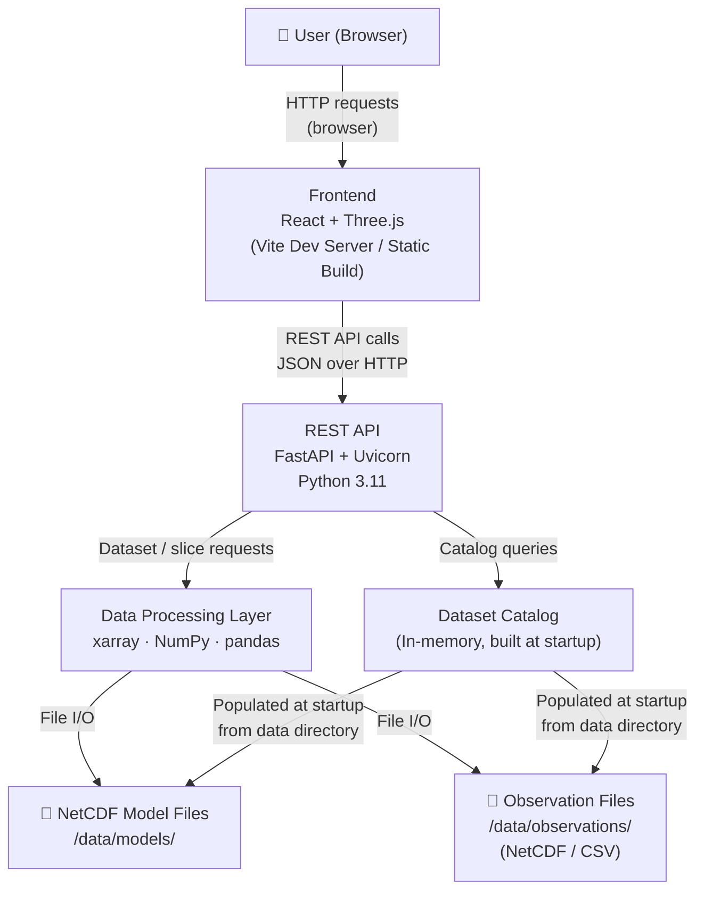
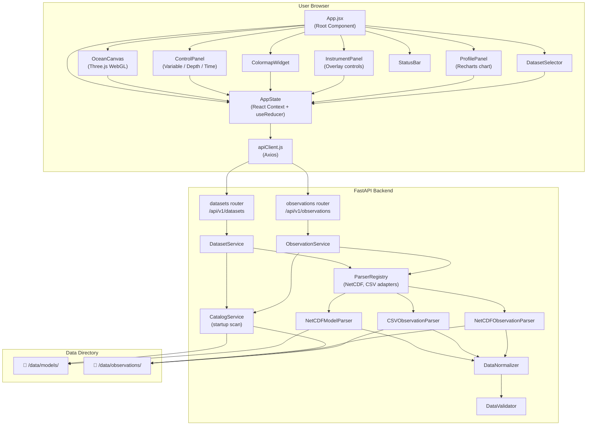

# Technical Architecture Document

## 3D Ocean Data Visualization System for INCOIS

| Field        | Value                                              |
|--------------|----------------------------------------------------|
| Document ID  | ARCH-INCOIS-3DVIZ-001                              |
| Version      | 2.0                                                |
| Status       | Target Architecture for Final Client Delivery      |
| Date         | 2026-08-31                                         |

---

## Table of Contents

1. Architecture Goals
2. Technology Stack
3. Architecture Diagram
4. Frontend Architecture
5. Backend Architecture
6. Data Architecture
7. Data Flow
8. API Architecture
9. Scientific Visualization Architecture
10. Extensibility Architecture
11. Deployment Architecture
12. Security
13. Performance
14. Technology Decisions

---

## 1. Architecture Goals

The architecture for V1 must satisfy the following goals, in order of priority:

| Priority | Goal                                                                                            |
|----------|-------------------------------------------------------------------------------------------------|
| 1        | **Correctness**: Scientific data values must be faithfully represented in the visualization     |
| 2        | **Implementability**: V1 must be buildable by a small team or AI agent in a bounded timeframe  |
| 3        | **Modularity**: Adding new data parsers or variables must not require changes to core components|
| 4        | **Performance**: The browser must not freeze; data transfer must be minimized                  |
| 5        | **Extensibility**: Architecture must not prevent future addition of sensors, APIs, or standards |
| 6        | **Simplicity**: Prefer fewer moving parts; do not add infrastructure without justification     |

> **NOTE (August 2026):** This architecture document has been updated to reflect the Final INCOIS Client Requirements. Previous restrictions preventing volumetric rendering and new data sources are now OBSOLETE.
>
> **COMPULSORY 3D REQUIREMENT — FOR ALL IMPLEMENTERS:**
> The system is a **genuine browser-native interactive 3D WebGL ocean visualization application**. The primary visualization is a Three.js 3D scene with full camera controls (rotate/zoom/pan via OrbitControls), depth-positioned mesh layers, vertical exaggeration, 3D instrument markers, current vector arrows in 3D space, and time animation. The application is NOT a 2D map.
>
> **Visualization Modes (All required for final delivery):**
> - **Full volumetric rendering** (per-voxel transparency transfer functions across the entire 3D scalar field via WebGL raymarching/Data3DTexture) — is **P0/MUST HAVE**.
> - **Isosurface extraction/rendering** — is **P0/MUST HAVE**.
> - **3D depth-slice visualization** — colored meshes positioned at depth in the 3D scene — is **P0/MUST HAVE**.
> - **Current vector visualization** (U/V arrows as `THREE.ArrowHelper` in 3D space) — is **P0/MUST HAVE**.
> - **Vertical exaggeration** (scaling the Y-axis in the 3D scene) — is **P0/MUST HAVE**.
> - **Instrument profile chart** — is a **2D supplementary panel** (Recharts depth-vs-variable chart). It augments but does not replace the 3D ocean scene.

---

## 2. Technology Stack

### 2.1 Frontend

| Technology      | Selected | Version Target  | Role                                          |
|-----------------|----------|-----------------|-----------------------------------------------|
| React           | ✅ Yes   | 18.x            | Component-based UI framework                  |
| Vite            | ✅ Yes   | 5.x             | Build tool and dev server (fast, modern)       |
| Three.js        | ✅ Yes   | r160+           | WebGL 3D scene management and rendering        |
| Recharts        | ✅ Yes   | 2.x             | 2D profile chart rendering                    |
| Axios           | ✅ Yes   | 1.x             | HTTP client for REST API calls                |
| Cesium.js       | ❌ No    | —               | See Technology Decisions (§14)                |

**No additional UI framework (e.g., Material UI, Tailwind)** is mandated; plain CSS modules are used for V1 to minimize dependencies.

### 2.2 Backend

| Technology      | Selected | Version Target  | Role                                          |
|-----------------|----------|-----------------|-----------------------------------------------|
| Python          | ✅ Yes   | 3.11+           | Backend runtime                               |
| FastAPI         | ✅ Yes   | 0.110+          | REST API framework                            |
| Uvicorn         | ✅ Yes   | 0.29+           | ASGI server for FastAPI                       |
| xarray          | ✅ Yes   | 2024.x          | Primary NetCDF dataset reading and subsetting |
| netCDF4         | ✅ Yes   | 1.6+            | Underlying NetCDF library (xarray dependency) |
| NumPy           | ✅ Yes   | 1.26+           | Array operations and data normalization       |
| pandas          | ✅ Yes   | 2.x             | CSV/ASCII observation file parsing            |
| Flask           | ❌ No    | —               | See Technology Decisions (§14)                |

### 2.3 Scientific Data Processing

| Technology      | Selected | Version Target  | Role                                          |
|-----------------|----------|-----------------|-----------------------------------------------|
| xarray          | ✅ Yes   | —               | NetCDF parsing, coordinate access, subsetting |
| NumPy           | ✅ Yes   | —               | Isosurface threshold computation, fill masks  |
| pandas          | ✅ Yes   | —               | CSV/ASCII data into structured DataFrames     |
| SciPy           | 🔲 Optional | —            | Isosurface computation if CH-001 is implemented|

### 2.4 Development Tools

| Tool            | Role                                          |
|-----------------|-----------------------------------------------|
| ESLint          | Frontend code linting                         |
| Prettier        | Frontend code formatting                      |
| Black           | Backend Python code formatting                |
| pytest          | Backend unit tests                            |
| Vitest          | Frontend unit tests                           |
| python-dotenv   | Environment variable loading for backend      |
| venv            | Python virtual environment isolation          |

---

## 3. Architecture Diagram

### 3.1 System Context Diagram



### 3.2 Detailed Component Diagram



---

## 4. Frontend Architecture

### 4.1 Component Tree

```
App.jsx
├── DatasetSelector            — Dropdown(s) for model + observation datasets
├── OceanCanvas                — Three.js WebGL rendering canvas
│   ├── DepthSliceMesh         — PlaneGeometry colored mesh for model variable
│   ├── InstrumentLayer        — Points/markers for Argo/Glider positions
│   └── VectorLayer            — ArrowHelper instances for U/V current display
├── ControlPanel               — Right-side panel housing all interactive controls
│   ├── VariableSelector       — Dropdown for model variable selection
│   ├── DepthControl           — Slider for depth level selection
│   ├── TimeControl            — Slider + Play/Pause/Step buttons + speed input
│   ├── LayerControl           — Toggle switches + opacity slider
│   └── VerticalExaggeration   — Slider for exaggeration factor
├── ColormapWidget             — Colorbar display + palette picker + min/max inputs
├── InstrumentPanel            — Toggle controls for Argo/Glider layer visibility
├── ProfilePanel               — Instrument metadata + Recharts depth-profile chart
└── StatusBar                  — Active dataset / variable / depth / time / loader
```

### 4.2 State Management

V1 uses **React Context + useReducer** for global application state. This avoids the overhead of Redux while providing a predictable state container that can be migrated to Redux or Zustand in future versions if needed.

**Global State Shape:**

```javascript
{
  // Dataset state
  availableDatasets: [],          // catalog from GET /api/v1/datasets
  activeDatasetId: null,          // currently selected model dataset ID
  activeDatasetMeta: null,        // metadata for active dataset

  // Available controls (populated from dataset metadata)
  variables: [],                  // list of variable names
  depths: [],                     // list of depth values (meters)
  times: [],                      // list of time step strings

  // Active selections
  activeVariable: null,
  activeDepthIndex: 0,
  activeTimeIndex: 0,

  // Visualization parameters
  colormapPalette: 'viridis',
  colormapMin: null,              // null = auto from data
  colormapMax: null,              // null = auto from data
  colormapScale: 'linear',        // 'linear' | 'log'
  layerOpacity: 1.0,
  verticalExaggeration: 50,       // default; real ocean aspect ratio requires exaggeration
  showCurrentVectors: false,

  // Instrument state
  availableObservations: [],      // catalog from GET /api/v1/observations
  activeObsDatasetId: null,
  showArgoLayer: true,
  showGliderLayer: true,
  instruments: [],                // list of instrument objects with lat/lon/id/type
  selectedInstrumentId: null,     // which instrument is selected for profile
  profileData: null,              // profile data for selected instrument

  // Slice data
  sliceData: null,                // {grid: [...], values: [...], lat: [...], lon: [...]}

  // UI state
  isLoading: false,
  error: null,
  isAnimating: false,
  animationSpeed: 1,              // seconds per frame
}
```

### 4.3 Three.js Visualization Engine

The `OceanCanvas` component manages the Three.js scene lifecycle within a React `useEffect` cleanup pattern:

**Scene Setup:**
- `THREE.Scene` with `THREE.PerspectiveCamera`
- `THREE.OrbitControls` for user camera interaction (rotate, zoom, pan)
- Ambient + directional lighting for visual clarity
- A `THREE.AxesHelper` for orientation in development mode

**Depth-Slice Mesh Rendering:**
- Model data slice is returned by the backend as a 2D array of `{lat, lon, value}` points on a regular grid
- The frontend creates a `THREE.PlaneGeometry` subdivided to match the data grid resolution
- Vertex colors are assigned by mapping each grid value through the active colormap function
- The plane is positioned in 3D space: X = longitude (mapped to scene units), Y = depth (multiplied by vertical exaggeration factor), Z = latitude (mapped to scene units)
- Missing/NaN values render as fully transparent vertices

**Coordinate Mapping (Geographic → Scene):**
```
scene_x = (lon - lon_center) * scale_factor
scene_y = -depth_m * vertical_exaggeration * depth_scale_factor
scene_z = (lat - lat_center) * scale_factor
```

This preserves geographic accuracy in the horizontal plane while allowing depth to be visually exaggerated.

**Colormap Function:**
- Named color palettes (viridis, plasma, coolwarm, jet) are defined as lookup tables in the frontend
- The colormap function maps a normalized value [0, 1] to an RGB color using the active palette
- Clamping is applied at colormap min/max boundaries

**Instrument Markers:**
- Argo floats: `THREE.Points` with a circular `THREE.SphereGeometry` sprite or custom `THREE.BufferGeometry` point cloud
- Gliders: styled differently (e.g., different color or shape) using the same `THREE.Points` system
- On click, a raycaster detects which marker was hit and dispatches a state update to load the profile

**Current Vectors:**
- `THREE.ArrowHelper` instances placed at grid sample points (subsampled for performance)
- Arrow direction from (u, v) components; length scaled by magnitude

### 4.4 Data Fetching

All API calls are centralized in `src/api/apiClient.js`:

```javascript
// Example API functions
fetchDatasets()                                              → GET /api/v1/datasets
fetchDatasetMeta(id)                                         → GET /api/v1/datasets/{id}
fetchVariables(id)                                           → GET /api/v1/datasets/{id}/variables
fetchDepths(id)                                              → GET /api/v1/datasets/{id}/depths
fetchTimes(id)                                               → GET /api/v1/datasets/{id}/times
fetchSlice(id, variable, depthIdx, timeIdx)                  → GET /api/v1/datasets/{id}/data?...
fetchObservations()                                          → GET /api/v1/observations
fetchObsDatasetInstruments(datasetId)                        → GET /api/v1/observations/{datasetId}/instruments
fetchProfile(datasetId, instrumentId)                        → GET /api/v1/observations/{datasetId}/instruments/{instrumentId}/profile
```

React `useEffect` hooks in components subscribe to relevant state changes and dispatch API calls.

---

## 5. Backend Architecture

### 5.1 Directory Structure

```
backend/
├── main.py                    — FastAPI application entry point
├── config.py                  — Configuration (data dir, CORS origins, etc.)
├── api/
│   ├── __init__.py
│   ├── datasets.py            — /api/v1/datasets router
│   └── observations.py        — /api/v1/observations router
├── services/
│   ├── __init__.py
│   ├── catalog_service.py     — Scans data dir; builds dataset + obs catalogs
│   ├── dataset_service.py     — Orchestrates parsing and normalization for model data
│   └── observation_service.py — Orchestrates parsing and normalization for obs data
├── parsers/
│   ├── __init__.py
│   ├── base_parser.py         — Abstract base class for all parsers
│   ├── registry.py            — ParserRegistry: maps file extension/type to parser class
│   ├── netcdf_model_parser.py — Parses model NetCDF using xarray
│   ├── netcdf_obs_parser.py   — Parses observation NetCDF using xarray
│   └── csv_obs_parser.py      — Parses CSV/ASCII observation files using pandas
├── normalizers/
│   ├── __init__.py
│   └── data_normalizer.py     — Converts parsed data to normalized internal schema
├── validators/
│   ├── __init__.py
│   └── data_validator.py      — Validates normalized data; raises structured errors
├── models/
│   ├── __init__.py
│   └── schemas.py             — Pydantic models for API request/response schemas
├── cache/
│   ├── __init__.py
│   └── slice_cache.py         — Simple in-memory LRU cache for data slices
├── data/
│   ├── models/                — NetCDF model files placed here
│   └── observations/          — Argo/Glider NetCDF and CSV files placed here
├── tests/
│   ├── test_parsers.py
│   ├── test_api.py
│   └── conftest.py
├── requirements.txt
└── .env.example
```

### 5.2 API Layer

FastAPI is used with two routers: one for model datasets, one for observation data.

All API responses return JSON. Errors return structured JSON:
```json
{
  "error": true,
  "code": "PARSE_ERROR",
  "message": "Could not read depth dimension from file: example.nc",
  "detail": "..."
}
```

### 5.3 Catalog Service

At startup, `CatalogService` scans `/data/models/` and `/data/observations/`, attempts to open each file using the appropriate parser, extracts metadata, and builds an in-memory catalog (Python dict). The catalog is shared across request handlers via FastAPI dependency injection.

Catalog refresh can be triggered by restarting the backend (V1) or via a future admin endpoint (post-V1).

### 5.4 Parser Layer

The `ParserRegistry` maps file characteristics (extension, directory) to the appropriate parser class. Each parser implements `BaseParser`:

```python
class BaseParser(ABC):
    @abstractmethod
    def can_parse(self, file_path: Path) -> bool:
        """Return True if this parser can handle the given file."""

    @abstractmethod
    def get_metadata(self, file_path: Path) -> DatasetMetadata:
        """Return dataset metadata without loading full data."""

    @abstractmethod
    def get_slice(self, file_path: Path, variable: str, depth_idx: int, time_idx: int) -> DataSlice:
        """Return a single variable/depth/time slice."""
```

Registered parsers for V1:
- `NetCDFModelParser` — handles `.nc` files in the models directory
- `NetCDFObsParser` — handles `.nc` files in the observations directory
- `CSVObsParser` — handles `.csv` and `.txt` files in the observations directory

Adding a new parser requires only:
1. Creating a new class inheriting `BaseParser`
2. Registering it in `ParserRegistry` with its match condition

No existing parsers or API routes need to change.

### 5.5 Normalization Layer

`DataNormalizer` converts parser output into the internal normalized schema (defined in §6). It handles:

1. **Longitude normalization:** Convert 0–360 longitude to −180–180. Applies to BOTH model and observation data so instrument markers are geographically consistent with depth-slice meshes.
2. **Latitude canonical sort:** All latitude arrays MUST be sorted to ascending order (South-to-North, `lat[0]` = southernmost) before producing output. This prevents upside-down mesh rendering for datasets that store latitudes North-to-South.
3. **Fill/NaN value masking:** CF `_FillValue` and `missing_value` attributes are read; all matching values are replaced with `None` in the output. xarray masked arrays are handled via `.values` extraction with `np.nan` → `None` conversion. `value_min` / `value_max` are computed **after** masking (excluding `None` values).
4. **Pressure-to-depth conversion:** When a true depth coordinate in meters is available in the dataset (CF `standard_name: depth`, units `m`), it MUST be used directly. Only when no true depth coordinate exists and the dataset provides a pressure coordinate (units `dbar` or `decibars`) should the normalizer apply the approximation: `depth_m ≈ pressure_dbar × 0.9804`. This is an approximation only; it must not be represented as scientifically exact. The exact methodology is TBD-06 (PROJECT OWNER DECISION REQUIRED). A metadata flag (`depth_from_pressure: true`) is included in the response when an approximation was used.
5. **Dimension name aliasing:** The normalizer resolves standard dimension concepts by checking the following name aliases in order (first match wins):
   - Latitude: `lat`, `latitude`, `y`, `nav_lat`, `LATITUDE`
   - Longitude: `lon`, `longitude`, `x`, `nav_lon`, `LONGITUDE`
   - Depth: `depth`, `lev`, `level`, `z`, `depth_m`, `DEPTH`, `PRES`
   - Time: `time`, `time_counter`, `ocean_time`, `T`, `JULD`
   - Alias list is configurable in `config.py` (`DIMENSION_ALIASES` dict). Datasets using none of the listed aliases for a required dimension are logged as warnings and the relevant feature (depth slider, time animation) is disabled for that dataset.
6. **U/V current variable detection:** The parser first checks each variable's CF `standard_name` attribute for `eastward_sea_water_velocity` (u) and `northward_sea_water_velocity` (v). If CF `standard_name` is absent or does not match, the parser falls back to name-based aliases: U = `['uo', 'ucur', 'u_current', 'UVEL', 'vozocrtx']`; V = `['vo', 'vcur', 'v_current', 'VVEL', 'vomecrty']`. Short ambiguous names such as `u` or `v` alone are NOT assumed to be geographic velocity components unless CF metadata or dataset-specific configuration explicitly confirms them. The `has_u_v` flag in `DatasetMetadata` is set `true` only when both components are positively identified as geographic eastward/northward velocity.
7. **QC flag masking (Argo):** Argo NetCDF QC flag variables (e.g., `TEMP_QC`, `PSAL_QC`) use integer flags where values ≥ 3 indicate bad or questionable data. Values at positions with QC flag ≥ 3 MUST be masked to `None`.
8. **Unit conversions:** Where CF attributes provide `units`, standard conversions are applied if needed (e.g., temperature K → °C when `units = 'K'` and `standard_name` indicates temperature). Configurable in `config.py`.

### 5.6 Validation Layer

`DataValidator` applies checks after normalization:
- At minimum: lat and lon dimensions must be present
- Optional dimensions (depth, time) produce warnings but not errors if absent
- Value range sanity checks (TBD per variable)
- Raises `ValidationError` with structured detail on failure

### 5.7 Caching

An in-memory LRU cache (`slice_cache.py`) stores recently requested data slices using a key of `(dataset_id, variable, depth_idx, time_idx)`. This prevents redundant file reads when the user replays an animation or switches between recent configurations. Cache size limit is configurable (default: 50 entries) and can be disabled by setting `CACHE_ENABLED=false` in environment configuration.

---

## 6. Data Architecture

### 6.1 Internal Data Schemas (Pydantic Models)

#### DatasetMetadata
```python
class DatasetMetadata(BaseModel):
    id: str                    # Unique ID derived from filename
    name: str                  # Human-readable dataset name
    file_path: str             # Absolute path on server filesystem
    format: str                # 'netcdf' | 'csv'
    dataset_type: str          # 'model' | 'observation'
    variables: List[str]       # Available scalar variable names
    has_u_v: bool              # True if u and v current components present
    depth_levels: List[float]  # List of depth values in meters (may be empty)
    time_steps: List[str]      # List of ISO 8601 time strings (may be empty)
    lat_min: float
    lat_max: float
    lon_min: float
    lon_max: float
    metadata_attrs: Dict[str, str]  # Raw CF/global attributes
```

#### DataSlice
```python
class DataSlice(BaseModel):
    dataset_id: str
    variable: str
    depth_m: float             # Actual depth value in meters
    timestamp: str             # ISO 8601 timestamp
    lat: List[float]           # 1D list of latitude values (grid Y axis)
    lon: List[float]           # 1D list of longitude values (grid X axis)
    values: List[List[float]]  # 2D array: values[lat_idx][lon_idx]; None for missing
    units: Optional[str]       # Variable units if available from CF attributes
    value_min: float           # Actual min value in this slice (for colorbar auto-ranging)
    value_max: float           # Actual max value in this slice
```

#### InstrumentRecord
```python
class InstrumentRecord(BaseModel):
    id: str                    # Unique instrument identifier
    instrument_type: str       # 'argo' | 'glider'
    dataset_id: str            # Parent observation dataset ID
    lat: float                 # Geographic position
    lon: float
    timestamp: Optional[str]   # Measurement date/time
    available_profile_vars: List[str]  # Variables available in profile
```

#### ProfileData
```python
class ProfileData(BaseModel):
    instrument_id: str
    instrument_type: str
    lat: float
    lon: float
    timestamp: Optional[str]
    profiles: Dict[str, List[Optional[float]]]  # variable_name → values at each depth
    depths: List[float]                          # Depth values in meters
    units: Dict[str, str]                        # variable → units string
```

#### VectorSlice
```python
class VectorSlice(BaseModel):
    dataset_id: str
    depth_m: float
    timestamp: str
    lat: List[float]
    lon: List[float]
    u: List[List[float]]       # East component; None for missing
    v: List[List[float]]       # North component; None for missing
    speed_max: float           # Maximum speed magnitude for arrow scaling
```

---

## 7. Data Flow

### 7.1 Model Data Flow

```
1. Raw NetCDF file on server filesystem
        │
        ▼
2. CatalogService (at startup)
   → Calls NetCDFModelParser.get_metadata(file)
   → Resolves dimension names via alias table (§5.5 rule 5)
   → Builds DatasetMetadata entry (has_u_v flag set via rule 6)
   → Stores in in-memory catalog
        │
        ▼
3. Frontend: GET /api/v1/datasets
   → Returns list of DatasetMetadata (without slice data)
        │
        ▼
4. User selects dataset + variable + depth + time
        │
        ▼
5. Frontend: GET /api/v1/datasets/{id}/data?variable=temp&depth_idx=2&time_idx=0
        │
        ▼
6. DatasetService
   → Checks slice cache (cache hit → return immediately)
   → Cache miss → ParserRegistry.get_parser(file)
   → NetCDFModelParser.get_slice(file, variable, depth_idx, time_idx)
        │
        ▼
7. NetCDFModelParser (xarray)
   → Opens NetCDF with xarray (decode_times=True, decode_cf=True)
   → Resolves dimension names via alias table → resolved_lat, resolved_lon,
     resolved_depth_dim, resolved_time_dim
   → Selects dataset[variable].isel(resolved_depth_dim=depth_idx,
     resolved_time_dim=time_idx)
   → Extracts lat/lon arrays and value grid
   → Identifies fill values (_FillValue, missing_value) → converts to None
        │
        ▼
8. DataNormalizer
   → Sorts latitude to canonical ascending order (South-to-North)
   → Normalizes lon range: 0–360 → -180–180
   → Converts pressure (dbar) → depth (meters) if depth units are dbar
   → Masks None/NaN values; computes value_min, value_max (excluding None)
   → Produces DataSlice object
        │
        ▼
9. DataValidator
   → Confirms lat/lon present
   → Raises ValidationError if critical dimensions missing
        │
        ▼
10. DataSlice → JSON response (gzip-compressed) → Frontend
        │
        ▼
11. OceanCanvas (Three.js)
    → Receives DataSlice
    → Maps values through active colormap function → vertex colors
    → Updates PlaneGeometry vertex colors in-place (needsUpdate = true)
    → Three.js renders updated mesh at next animation frame
```

### 7.2 Observation Data Flow

```
1. Raw Argo/Glider NetCDF or CSV file on server filesystem
        │
        ▼
2. CatalogService (at startup)
   → Calls appropriate parser.get_metadata(file)
   → Builds ObservationDatasetSummary (id, name, type, instrument_count, bbox)
   → Builds InstrumentRecord list for each instrument in the file
   → Stores both in in-memory observation catalog
        │
        ▼
3. Frontend: GET /api/v1/observations
   → Returns list of ObservationDatasetSummary objects
     (dataset-level summary with instrument counts — not all individual records)
        │
        ▼
3b. User selects an observation dataset
    Frontend: GET /api/v1/observations/{dataset_id}/instruments
    → Returns list of InstrumentRecord objects (lat/lon/id/type)
        │
        ▼
4. InstrumentLayer (Three.js)
   → Renders 3D markers at each instrument's lat/lon
     (lon normalized to -180/+180; same coordinate space as depth-slice mesh)
        │
        ▼
5. User clicks instrument marker
        │
        ▼
6. Frontend: GET /api/v1/observations/{dataset_id}/instruments/{instrument_id}/profile
        │
        ▼
7. ObservationService
   → Locates instrument record by dataset_id + instrument_id
   → Calls parser.get_profile(file, instrument_id)
        │
        ▼
8. Parser (NetCDFObsParser or CSVObsParser)
   → Extracts depth array (pressure dbar → meters if needed)
   → Extracts profile variable arrays
   → Applies QC flag masking (Argo flag ≥ 3 = bad → None)
   → Identifies and masks all other missing values
        │
        ▼
9. DataNormalizer → ProfileData object
   → Normalizes observation lon to -180/+180
        │
        ▼
10. ProfileData → JSON response (gzip-compressed) → Frontend
        │
        ▼
11. ProfilePanel (Recharts)
    → Renders variable vs depth chart
      (depth in meters on Y-axis, increasing downward)
    → User can switch profile variable via dropdown
```

---

## 8. API Architecture

### 8.1 Base URL

```
http://localhost:8000/api/v1
```

The `/v1` version prefix allows future API versioning without breaking existing consumers. In production, the base URL is configured via the `VITE_API_BASE_URL` environment variable in the frontend. The frontend **must never hardcode** `localhost` or any hostname — all API calls must go through the `apiClient.js` module which reads `VITE_API_BASE_URL`.

### 8.2 Model Dataset Endpoints

```
GET /api/v1/datasets
```
Returns the list of discovered model datasets with metadata.

**Response:** `Array<DatasetMetadataSummary>` (id, name, variables, depth count, time count, bounding box)

---

```
GET /api/v1/datasets/{id}
```
Returns full metadata for a specific dataset.

**Response:** `DatasetMetadata`

---

```
GET /api/v1/datasets/{id}/variables
```
Returns list of available variable names and their units/descriptions for a dataset.

**Response:** `Array<{name: string, long_name: string, units: string}>`

---

```
GET /api/v1/datasets/{id}/depths
```
Returns ordered list of available depth levels.

**Response:** `Array<{index: int, depth_m: float}>`

---

```
GET /api/v1/datasets/{id}/times
```
Returns ordered list of available time steps.

**Response:** `Array<{index: int, timestamp: string}>`

---

```
GET /api/v1/datasets/{id}/data
```
Returns a single data slice.

**Query parameters:**
- `variable` (required): variable name string
- `depth_idx` (required): integer index into the depths array
- `time_idx` (required): integer index into the times array

**Response:** `DataSlice`

---

```
GET /api/v1/datasets/{id}/vectors
```
Returns U/V current vector slice. Returns 404 if dataset has no u/v variables.

**Query parameters:** same as `/data`

**Response:** `VectorSlice`

### 8.3 Observation Endpoints

```
GET /api/v1/observations
```
Returns list of all discovered observation datasets and their instrument counts.

**Response:** `Array<{id, name, type, instrument_count, lat_min, lat_max, lon_min, lon_max}>`

---

```
GET /api/v1/observations/{dataset_id}/instruments
```
Returns list of all instruments in an observation dataset.

**Response:** `Array<InstrumentRecord>`

---

```
GET /api/v1/observations/{dataset_id}/instruments/{instrument_id}
```
Returns metadata for a specific instrument.

**Response:** `InstrumentRecord`

---

```
GET /api/v1/observations/{dataset_id}/instruments/{instrument_id}/profile
```
Returns depth profile data for the specified instrument.

**Response:** `ProfileData`

### 8.4 Error Response Schema

All error responses use HTTP 4xx or 5xx status codes with body:

```json
{
  "error": true,
  "code": "DATASET_NOT_FOUND | PARSE_ERROR | VALIDATION_ERROR | VARIABLE_NOT_FOUND | SERVER_ERROR",
  "message": "Human-readable error description",
  "detail": "Optional technical detail"
}
```

---

## 9. Scientific Visualization Architecture

### 9.0 V1 Visualization Modes — 3D vs. Volumetric Distinction

This section clarifies the distinction between V1 visualization modes to prevent implementation errors.

| Mode                          | V1 Status        | Description                                                                                                                        | Implementation Technology                    |
|-------------------------------|------------------|------------------------------------------------------------------------------------------------------------------------------------|----------------------------------------------|
| **3D Depth-Slice Visualization** | **P0 — MUST HAVE** | A horizontal mesh plane rendered inside the Three.js 3D scene at a specified depth. The plane is colored by variable value. The user can rotate/zoom/pan the camera, change depth level (moving the plane along Y-axis), and animate across time steps. **This IS 3D visualization.** | `THREE.PlaneGeometry` + vertex colors, Y-position at depth |
| **Current Vector Visualization** | **P0 — MUST HAVE** | U/V current components rendered as directional `THREE.ArrowHelper` objects in 3D space, placed on the depth-slice plane. They rotate with the camera and are true 3D objects. | `THREE.ArrowHelper` on depth-slice Y-plane  |
| **Vertical Exaggeration**     | **P0 — MUST HAVE** | User-controlled multiplicative factor applied to the Y-axis (depth) of the 3D scene. Makes ocean depth structure visible by stretching the depth axis relative to horizontal. Horizontal lat/lon coordinates are unchanged. | Per-object Y-position scaling, no data re-fetch |
| **Isosurface Rendering**      | **P2 — COULD HAVE** | A 3D surface mesh (computed from multiple depth-level slices) showing where a variable equals a threshold value. Built on top of the P0 depth-slice pipeline. Must not block P0/P1 delivery. | Backend marching-squares/cubes, frontend `THREE.Mesh` |
| **Full Volumetric Rendering** | **FUTURE — Not V1** | Rendering the entire 3D scalar field with per-voxel opacity transfer functions (e.g., volume ray casting). Requires a fundamentally different rendering approach (custom GLSL shaders or WebGL2 3D textures). Distinct from depth-slice 3D visualization. | Post-V1 via Three.js custom shader or WebGPU |
| **Instrument Profile Chart**  | **P0 — MUST HAVE** | A **2D** chart (Recharts) showing one observed variable plotted against depth. This is a supplementary panel rendered alongside (not instead of) the 3D ocean scene. | Recharts `ComposedChart` with flipped Y-axis |

> **IMPLEMENTATION RULE:** Do NOT implement the primary ocean model visualization as a flat 2D map. The depth-slice mesh MUST be a `THREE.Mesh` object inside a `THREE.Scene` viewable from any camera angle. A camera rotation that reveals the mesh edge-on (confirming its 3D position) is the primary acceptance test (VAC-12).

---

### 9.1 Coordinate System

The 3D scene uses a custom scientific coordinate system:

| Axis   | Direction       | Mapped From            | Units                              |
|--------|-----------------|------------------------|------------------------------------|
| X      | East (+)        | Longitude              | Scene units                        |
| Y      | Up (+)          | Depth (inverted, × VE) | Scene units × vertical exaggeration |
| Z      | North (+)       | Latitude               | Scene units                        |

**Horizontal Scale:** Degrees are mapped to scene units using a fixed scale factor. Geographic accuracy is maintained in the horizontal plane. Changing vertical exaggeration does NOT alter X or Z coordinates.

**Vertical Scale:** Depth in meters is converted to scene units with the vertical exaggeration multiplier applied:
```
scene_y = -(depth_m / 1.0) * vertical_exaggeration * DEPTH_SCALE_CONSTANT
```

The default `vertical_exaggeration = 50` makes the ocean depth visually comparable to the horizontal domain extent for a typical regional model. This default is necessary because a true-scale representation of the ocean (5000 m deep vs. 1000 km wide = 0.5% aspect ratio) would make all depth structure invisible. Users adjust via the P0 vertical exaggeration slider (FR-011).

**Coordinate/Data Reordering Invariant:** When latitude or longitude arrays are sorted or wrapped during normalization, the corresponding data array dimensions MUST be reordered identically. For example, a South-to-North sort of the latitude index array must be applied to the `values[lat_idx][lon_idx]` array using the same permutation. Sorting coordinates without reordering data is a data corruption error that causes geographic misalignment in the 3D scene.

### 9.2 Depth-Slice Rendering

For each requested slice:
1. Backend returns a `DataSlice` with `lat[M]`, `lon[N]`, `values[M][N]`
2. Frontend creates a `THREE.PlaneGeometry(N-1, M-1, N-1, M-1)` — one quad per data cell
3. Vertex positions are set from the lat/lon grid mapped to scene coordinates
4. Each vertex color is computed by: `colormap(normalize(value, min, max))`
5. Missing values (`null`) set vertex alpha to 0 (fully transparent)
6. The geometry is attached to a `THREE.Mesh` with `THREE.MeshBasicMaterial({ vertexColors: true, transparent: true })`

**Update Strategy:** When the user changes variable/depth/time, a new slice is fetched. Instead of destroying and recreating the geometry, the vertex position buffer and color buffer are updated in place using `geometry.attributes.color.needsUpdate = true` for performance.

### 9.3 Colormap Implementation

Color palettes are defined as lookup tables in the frontend:

```javascript
// Each palette: array of [R, G, B] values (0–1 float) at regular intervals
const PALETTES = {
  viridis: [...],   // 256 entries
  plasma:  [...],
  coolwarm: [...],
  jet: [...]
};

function mapColor(value, min, max, palette, scale) {
  // Log-scale guard: if data range includes non-positive values, fall back to
  // linear and display a UI warning: "Log scale requires positive data range."
  if (scale === 'log' && min <= 0) {
    scale = 'linear';
    // dispatch UI warning in calling code
  }
  let t = (value - min) / (max - min);
  if (scale === 'log') t = Math.log10(value - min + 1) / Math.log10(max - min + 1);
  t = Math.max(0, Math.min(1, t));
  const idx = Math.round(t * (palette.length - 1));
  return palette[idx]; // [r, g, b]
}
```

### 9.4 Instrument Marker Rendering

- Use `THREE.BufferGeometry` with `THREE.Points` (and `THREE.PointsMaterial`) for efficient rendering of many markers in a **single draw call**. Do NOT use individual `THREE.SphereGeometry` or `THREE.Mesh` instances per marker — this creates one draw call per marker and will freeze the browser with hundreds of floats.
- Argo floats: `THREE.PointsMaterial` with yellow/orange color; rendered slightly above ocean surface (Y = 0 + small offset so markers are visible when looking down at ocean surface)
- Gliders: distinct color (cyan/teal) set as a second `THREE.Points` object
- Raycasting uses `THREE.Raycaster` with a threshold configured for marker point size
- On click: dispatcher receives `instrument_id`; state triggers profile API call

### 9.5 Current Vector Rendering (P0 — MUST HAVE)

> FR-006 has been **promoted to P0** (from P1). Current vectors are explicitly required by the project description as part of 3D ocean visualization alongside temperature and salinity.

When U/V data is available at the selected depth/time:
- **Speed guard:** Before rendering, compute `speed_max = max(sqrt(u² + v²))` over the subsampled grid (excluding `None`/masked values). If `speed_max < 1e-10` (zero-current or all-masked slice), skip arrow rendering entirely and leave the vector layer empty; no error is raised. This prevents division-by-zero producing `NaN` arrow lengths.
- Subsample the grid (every Nth point, configurable via `VECTOR_SUBSAMPLE_FACTOR`) to avoid visual clutter
- **Maximum arrow count: 500.** If the subsampled grid exceeds 500 arrows, increase the stride until the count is ≤ 500. This prevents excessive draw calls (each `THREE.ArrowHelper` creates two `LineSegments` internally).
- Create `THREE.ArrowHelper(direction, origin, length, color)` for each subsampled grid point
- Direction: `new THREE.Vector3(u_val, 0, v_val).normalize()` in scene coordinates (u → +X east, v → +Z north)
- Length: `Math.sqrt(u² + v²) / speed_max * MAX_ARROW_LENGTH` — proportional to speed, normalized to slice maximum
- All ArrowHelpers grouped into a single `THREE.Group` for efficient show/hide toggling
- The ArrowHelper group is positioned at the same Y-depth as the active depth-slice mesh
- When vertical exaggeration changes, all arrow Y-positions update to match the recalculated depth mesh position
- **Post-V1 optimization:** If frame rate is unacceptable at 500 arrows, replace `THREE.ArrowHelper` with a single `THREE.InstancedMesh` using a custom arrow geometry (one draw call for all arrows).

### 9.6 Time Animation

Animation is managed by a `setInterval` timer in the frontend. To prevent race conditions (multiple in-flight fetches producing out-of-order frame rendering), **`AbortController` MUST be used**:

```javascript
// Pseudocode with AbortController — prevents stale-response race condition
let activeController = null;

if (isAnimating) {
  const intervalMs = 1000 / animationSpeed;
  timer = setInterval(async () => {
    // Cancel any previous in-flight fetch before starting a new one
    if (activeController) activeController.abort();
    activeController = new AbortController();
    try {
      const slice = await fetchSlice({
        signal: activeController.signal, ...currentParams
      });
      dispatch({ type: 'SET_SLICE', payload: slice });
      dispatch({ type: 'NEXT_TIME_STEP' });
    } catch (e) {
      if (e.name !== 'AbortError') console.error('Animation error:', e);
      // AbortErrors are expected and intentionally ignored
    }
  }, intervalMs);
}
```

Only one slice request is in-flight at any time. Responses arriving after cancellation are discarded. Without `AbortController`, slow networks or large datasets will cause earlier time steps to overwrite later ones, producing visually incorrect animation.

### 9.7 Data Volume Management

| Dataset Size           | Strategy                                                         |
|------------------------|------------------------------------------------------------------|
| Small (< 50 MB)        | Direct xarray read; full slice extracted in memory               |
| Medium (50–500 MB)     | xarray lazy loading; only the requested variable/depth/time is loaded into memory |
| Large (> 500 MB)       | xarray lazy loading + server-side downsampling for display (reduce grid resolution by factor TBD if original exceeds MAX_GRID_POINTS) |
| Very Large (> 2 GB)    | TBD — possible chunked access via Dask xarray in future version  |

`MAX_GRID_POINTS = 200 × 200 = 40,000` is the default maximum grid resolution sent to the frontend. Finer grids are downsampled using `xarray.Dataset.coarsen()` or `isel` with stride. This parameter is configurable (TBD-03 — must be validated against INCOIS dataset resolution).

Asymmetric grids (e.g., 500 lon × 50 lat = 25,000 points total, below MAX_GRID_POINTS) are sent without downsampling; the mesh aspect ratio may appear distorted in the 3D scene — this is a known V1 limitation.

### 9.8 WebGL Resource Disposal

> **Critical for preventing GPU memory leaks.** Failure to dispose Three.js objects causes GPU memory accumulation that can crash the browser tab after repeated dataset switching.

When the user switches datasets, or when the `OceanCanvas` React component unmounts, the `useEffect` cleanup function MUST release all WebGL resources:

```javascript
// OceanCanvas useEffect cleanup:
return () => {
  // Dispose depth-slice mesh
  if (depthSliceMesh) {
    depthSliceMesh.geometry.dispose();
    depthSliceMesh.material.dispose();
    scene.remove(depthSliceMesh);
  }
  // Dispose current vector arrows
  vectorGroup.children.forEach(arrow => {
    arrow.line.geometry.dispose();
    arrow.cone.geometry.dispose();
  });
  scene.remove(vectorGroup);
  // Dispose instrument markers
  if (instrumentPoints) {
    instrumentPoints.geometry.dispose();
    instrumentPoints.material.dispose();
  }
  // Dispose renderer last (releases the WebGL context)
  renderer.dispose();
};
```

---

## 10. Extensibility Architecture

### 10.1 Adding a New Observation Source (e.g., CTD)

To add CTD support after V1:

1. Create `backend/parsers/netcdf_ctd_parser.py` implementing `BaseParser`
2. Register in `backend/parsers/registry.py`:
   ```python
   registry.register(NetCDFCTDParser(), condition=lambda f: 'ctd' in f.name.lower())
   ```
3. Place CTD NetCDF files in `/data/observations/`

No changes needed to:
- API routes
- `ObservationService`
- Frontend visualization components
- Any other existing parser

The `InstrumentRecord.instrument_type` field accommodates new types (e.g., `'ctd'`), and the frontend `InstrumentLayer` component renders markers for any instrument type.

### 10.2 Adding a New Model Variable

New scalar variables in a NetCDF dataset require **no code changes**. The backend automatically discovers all variables present in the file (excluding coordinate variables). The frontend variable selector dynamically lists them.

If a new variable requires a special colormap default or unit conversion, a lookup table in `config.py` can be extended:

```python
VARIABLE_DEFAULTS = {
  'temperature': {'palette': 'coolwarm', 'units': '°C'},
  'salinity':    {'palette': 'viridis',  'units': 'PSU'},
  'chlorophyll': {'palette': 'YlGn',    'units': 'mg/m³'},
  # Add new variables here without touching any other code
}
```

### 10.3 OGC WMS / WCS (Future Integration Points)

The API response format for `DataSlice` (lat/lon grid + values) is compatible with future tiling into OGC WMS layers. The architecture does not prevent a future WMS adapter from consuming the same `DataNormalizer` output.

### 10.4 OPeNDAP (Future Integration Points)

The `ParserRegistry` pattern allows a future `OPeNDAPParser` to fetch remote datasets transparently. The `DatasetService` and API routes do not need to change.

---

## 11. Deployment Architecture

### 11.1 V1 Deployment (Single Server)

```
┌──────────────────────────────────────────────────────┐
│  INCOIS Server (Linux / Windows) — V1                │
│                                                      │
│  ┌──────────────────────────────────────────────┐   │
│  │  Nginx (or Caddy)                            │   │
│  │  Port 80 / 443                               │   │
│  │  → Static frontend files (React build)       │   │
│  │  → Proxy /api/* → FastAPI on port 8000       │   │
│  └──────────────────────────────────────────────┘   │
│                                                      │
│  ┌────────────────────┐   ┌───────────────────┐     │
│  │ FastAPI (Uvicorn)  │   │ /data/            │     │
│  │ Port 8000          │   │  models/          │     │
│  │                    │   │  observations/    │     │
│  └────────────────────┘   └───────────────────┘     │
└──────────────────────────────────────────────────────┘
```

**V1 Deployment Steps:**
1. Build React frontend: `npm run build` → static files in `frontend/dist/`
2. Configure Nginx to serve `frontend/dist/` at root and proxy `/api/` to `localhost:8000`
3. Start FastAPI: `uvicorn main:app --host 0.0.0.0 --port 8000`
4. Place data files in `/data/models/` and `/data/observations/`
5. Restart backend to rebuild catalog

No Docker, Kubernetes, or cloud infrastructure is required or should be introduced in V1.

### 11.2 Development Environment

```
Terminal 1 (Backend):
  cd backend
  python -m uvicorn main:app --reload --port 8000

Terminal 2 (Frontend):
  cd frontend
  npm run dev          # Vite dev server on port 5173
```

Vite dev server proxies `/api` to `localhost:8000` via `vite.config.js`.

### 11.3 Future Deployment Considerations

- **Docker:** Containerizing frontend and backend is the recommended post-V1 step
- **Database:** If dataset metadata needs persistence beyond server restarts, SQLite → PostgreSQL migration is the path
- **Load balancing:** Multiple Uvicorn workers (via Gunicorn) before Nginx for multi-user load
- **Storage:** Network-attached storage for large dataset volumes

---

## 12. Security

### 12.1 V1 Security Controls

| Control                          | Implementation                                                                    |
|----------------------------------|-----------------------------------------------------------------------------------|
| Path Traversal Prevention        | Dataset IDs are validated against the in-memory catalog; arbitrary file paths are rejected |
| CORS                             | FastAPI `CORSMiddleware` allows only the configured frontend origin (`CORS_ORIGIN` env var) |
| Input Validation                 | All API query parameters validated by Pydantic before processing                 |
| Error Message Safety             | Internal stack traces are not exposed in API error responses                     |
| No Authentication (V1)           | V1 is deployed in internal/prototype context only; auth is a post-V1 concern     |
| HTTPS                            | Handled by reverse proxy (Nginx/Caddy) in deployment; not the backend's concern   |

### 12.2 Post-V1 Security Roadmap

- API key or JWT-based authentication
- Role-based access (read-only vs. admin for dataset management)
- Rate limiting on slice endpoints for large datasets
- Audit logging for dataset access

---

## 13. Performance

### 13.1 Identified Bottlenecks and Mitigations

| Bottleneck                           | Risk   | Mitigation                                                                                           |
|--------------------------------------|--------|------------------------------------------------------------------------------------------------------|
| Large NetCDF file reads              | High   | xarray lazy loading; only requested slice loaded into memory                                          |
| Repeated slice requests (animation)  | High   | In-memory LRU slice cache; `AbortController` cancels stale in-flight requests                        |
| Large grid → large JSON payload      | High   | Server-side downsampling (MAX_GRID_POINTS); FastAPI `GZipMiddleware` (minimum_size=1000) can significantly reduce payload size — actual reduction depends on data compressibility and must be benchmarked with representative datasets |
| Many ArrowHelper instances           | High   | Max 500 arrows rendered; increase stride if exceeded; `THREE.InstancedMesh` fallback post-V1          |
| Three.js geometry rebuild per frame  | Medium | In-place vertex buffer updates (`needsUpdate = true`) instead of geometry recreation                  |
| Many instrument markers              | Low    | `THREE.Points` (single draw call) instead of individual mesh objects                                  |
| GPU memory leak (WebGL)              | Medium | Explicit `.dispose()` in React `useEffect` cleanup (see §9.8)                                         |
| Slow profile API response            | Low    | Profile data is small; cache if needed                                                                |
| Cold catalog build at startup        | Low    | Fast for small numbers of files; acceptable for V1                                                    |

### 13.2 Performance Targets

> Exact millisecond targets require measurement against representative INCOIS datasets. The following are design targets pending benchmarking:

| Operation                          | Design Target (TBD with real data)                            |
|------------------------------------|---------------------------------------------------------------|
| Dataset catalog load (startup)     | TBD                                                           |
| Data slice API response time       | TBD — minimize via caching; cold read time depends on file size|
| Frontend scene render (60 fps)     | Not guaranteed; target: no freeze; smooth at resolution ≤ 200×200 |
| Time animation frame advance       | TBD — depends on cache hit rate; instant for cached slices    |
| Instrument profile API response    | TBD — expected fast due to small data volume                  |

---

## 14. Technology Decisions

### 14.1 Three.js vs. Cesium.js

| Criterion            | Three.js                                                                          | Cesium.js                                                                          |
|----------------------|-----------------------------------------------------------------------------------|------------------------------------------------------------------------------------|
| Use case             | General-purpose 3D scene; **custom coordinate system for regional ocean domains** | Globe-based geospatial 3D viewer; designed for planetary/satellite scale           |
| V1 requirement match | **Excellent** — custom depth-slice 3D scene, vertical exaggeration, U/V vector arrows in 3D space | **Partial** — globe model adds unnecessary complexity for regional/local ocean domains; depth exaggeration is non-trivial |
| 3D depth-slice rendering | Full control over geometry positioning and vertex colors              | Not natively supported; requires workarounds                                       |
| Vertical exaggeration | Trivial — multiply Y-position by scalar                                | Complex — would require custom 3D tileset or shader hacks                         |
| Current vector 3D arrows | Direct via `THREE.ArrowHelper`                                        | Requires custom entities or CZML                                                   |
| Volumetric rendering (Future) | Full control over geometry and shaders                           | Limited volumetric primitives without customization                                |
| Bundle size          | ~160 KB (tree-shaken)                                                             | ~8 MB+ (comprehensive globe engine)                                                |
| Learning curve       | Moderate                                                                          | High (Cesium-specific data formats, ion platform)                                  |
| Verdict              | ✅ **Selected** for V1 — the compulsory 3D interactive depth-slice visualization is best served by Three.js's flexible 3D scene graph | ❌ Not selected; reconsider only if global-scale globe rendering is required post-V1 |

### 14.2 FastAPI vs. Flask

| Criterion            | FastAPI                                           | Flask                                              |
|----------------------|---------------------------------------------------|----------------------------------------------------|
| Performance          | Async (ASGI); higher throughput for I/O-bound ops | Sync (WSGI) by default; async requires extensions  |
| Schema validation    | Built-in Pydantic models                          | Manual validation or external library required      |
| API documentation    | Auto-generated OpenAPI/Swagger UI                 | Requires flask-restx or similar extension           |
| Type safety          | Native Python type hints                          | Optional                                           |
| Modern standard      | ✅ Current Python API standard                    | Mature but not the current async-first choice      |
| Verdict              | ✅ **Selected** for V1                            | ❌ Not selected                                    |

### 14.3 xarray vs. netCDF4 (direct)

| Criterion            | xarray                                            | netCDF4 (direct)                                   |
|----------------------|---------------------------------------------------|----------------------------------------------------|
| Coordinate handling  | Automatic; dimension-labeled slicing               | Manual array indexing                               |
| CF Conventions       | Built-in support (`decode_cf=True`)               | Manual CF attribute interpretation                  |
| Lazy loading         | Native (Dask-optional)                            | Available but requires manual management            |
| Multi-format         | Supports NetCDF, GRIB, Zarr                       | NetCDF only                                         |
| Verdict              | ✅ **Selected** as primary parser library          | Used as xarray's underlying NetCDF engine via dependency |

### 14.4 React vs. Vue / Svelte

| Criterion            | React 18                                          | Vue 3 / Svelte                                     |
|----------------------|---------------------------------------------------|----------------------------------------------------|
| Ecosystem            | Largest; Recharts, Axios, Three.js integrations   | Good, but fewer Three.js integration examples       |
| AI agent familiarity | High — well-represented in training data          | Moderate                                           |
| Three.js integration | Proven pattern (useEffect + canvas ref)           | Similar pattern available                          |
| Verdict              | ✅ **Selected** for V1                            | Viable alternatives but not chosen for V1           |

### 14.5 Recharts vs. Chart.js / Plotly

| Criterion            | Recharts                                          | Chart.js             | Plotly.js              |
|----------------------|---------------------------------------------------|-----------------------|------------------------|
| React-native         | ✅ Yes — React component API                      | ❌ Requires wrapper   | ❌ Requires wrapper    |
| Horizontal bar chart | ✅ Yes (needed for depth profile Y-axis inversion) | ✅ Yes               | ✅ Yes                 |
| Bundle size          | ~180 KB                                           | ~160 KB               | ~3 MB+                 |
| Scientific features  | Adequate for depth profiles                       | Adequate              | Extensive (overkill V1)|
| Verdict              | ✅ **Selected** for V1                            | Alternative           | Not selected (large bundle) |

### 14.6 State Management: Context + useReducer vs. Redux

| Criterion            | React Context + useReducer                        | Redux Toolkit                                      |
|----------------------|---------------------------------------------------|----------------------------------------------------|
| Complexity           | Low — built into React                            | Medium — additional dependency                     |
| Sufficient for V1    | ✅ Yes — single-page app with bounded state        | Overkill for V1 scope                              |
| Migration path       | Can be refactored to Redux if needed              | N/A                                                |
| Verdict              | ✅ **Selected** for V1                            | Consider post-V1 if state complexity grows         |

---

*End of Architecture Document — Version 1.0*
